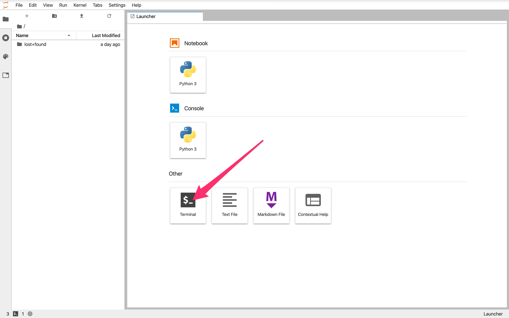

# How to set up Jupyter 

## for APMA E2000 students

## Columbia University, Spring 2020

This is a quick guide specifically for students in APMA E2000 at Columbia. 

  1. Navigate to [https://e2000.columbiajupyter2.org/](https://e2000.columbiajupyter2.org/).
  2. Log in with your Columbia UNI and password. 
  3. You should see a screen like below. Click on the icon for opening a new terminal. 
  4. One at a time, enter each of these commands at the `$`:
     ```pip install rise --user```
     ```pip install jupyter_contrib_nbextensions --user```
     ```jupyter contrib nbextension install --user```
     ```jupyter nbextension enable```

     
  5. Now you should be set. Click on any of the slides link on Courseworks. 