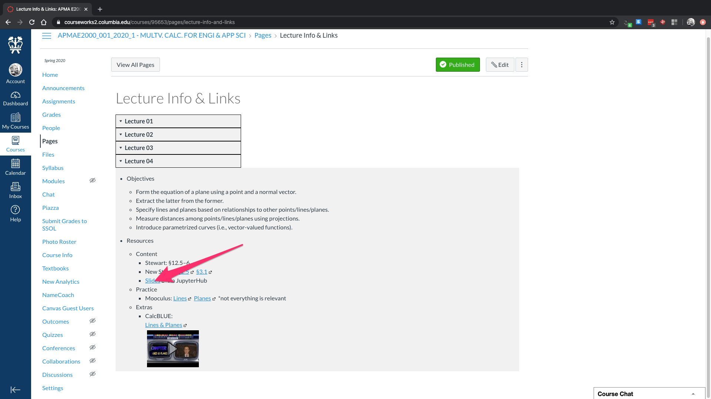
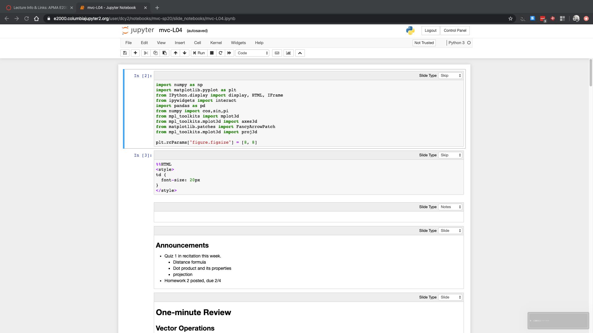
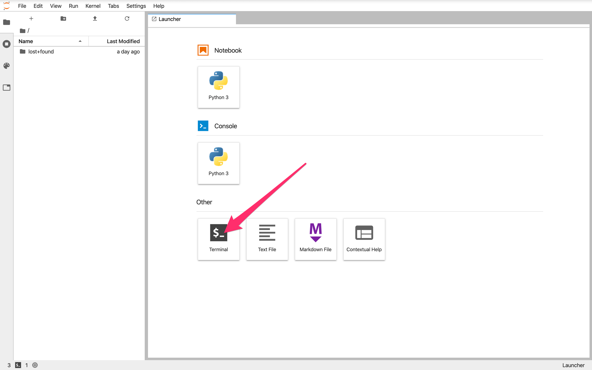
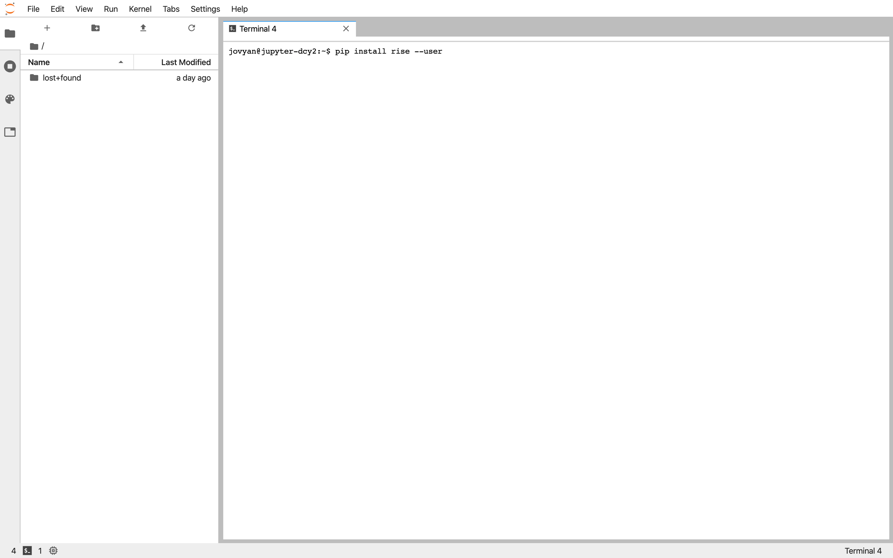

# How to set up Jupyter 

## for APMA E2000 students
## Columbia University, Spring 2020

This is a quick guide specifically for students in APMA E2000 at Columbia.

### Quick and Dirty

  1. Click on a [Slides link (like this one)](https://e2000.columbiajupyter2.org/hub/user-redirect/git-pull?repo=https%3A%2F%2Fgithub.com%2Fdrewyoungren%2Fmvc-sp20&urlpath=tree%2Fmvc-sp20%2Fslide_notebooks%2Fmvc-L04.ipynb) on the Lectures page in Courseworks.
  2. Log in with your Columbia UNI and password.
  3. After some starting up and loading, you should see this 
  4. To execute a cell, highlight it (like the first cell up above) and press <kbd>Shift</kbd>+<kbd>Enter</kbd>.
  5. Scroll down and execute cells to see what they do. (Always execute the first cell after opening; this is where necessary libraries are imported.)

### Bells and Whistles

  1. Navigate to [https://e2000.columbiajupyter2.org/](https://e2000.columbiajupyter2.org/).
  2. Log in with your Columbia UNI and password. 
  3. You should see a screen like below. Click on the icon for opening a new terminal. 
  4. One at a time, enter each of these commands at the `$`:

```pip install rise --user```

```pip install jupyter_contrib_nbextensions --user```

```jupyter contrib nbextension install --user```

```jupyter nbextension enable hide_input/main```

5. Now you should be set. Click on any of the [Slides](https://e2000.columbiajupyter2.org/hub/user-redirect/git-pull?repo=https%3A%2F%2Fgithub.com%2Fdrewyoungren%2Fmvc-sp20&urlpath=tree%2Fmvc-sp20%2Fslide_notebooks%2Fmvc-L04.ipynb) links on Courseworks. You''ll open a notebook with two new buttons.  The histogram-looking one starts a slideshow like those presented in class. The <kbd>^</kbd> button will hide/show the input box for the selected cell. This is good for hiiding long codes for graphics.